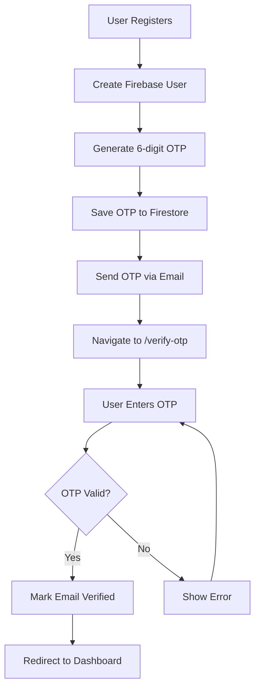

# OTP Verification System Setup Guide

## 🎯 Overview

This guide explains how to set up the OTP (One-Time Password) verification system for your SmartAgro application. The system includes:

- **Email Registration with OTP Verification**
- **Custom OTP Service with Firestore Storage**
- **Firebase Cloud Functions for Email Sending**
- **Development Mode with OTP Display**
- **Security Features (Rate Limiting, Expiry)**

## 🚀 Features Implemented

### ✅ **Authentication Flow**
1. **Registration**: User registers with email + password
2. **OTP Generation**: 6-digit OTP generated and stored in Firestore
3. **Email Sending**: OTP sent via Firebase Cloud Functions
4. **Verification Page**: Dedicated `/verify-otp` page for OTP input
5. **Dashboard Access**: Only after successful OTP verification

### ✅ **Security Features**
- **OTP Expiry**: 10 minutes expiration time
- **Rate Limiting**: Maximum 3 attempts per OTP
- **Firestore Storage**: Secure OTP storage with automatic cleanup
- **Email Verification**: Prevents unverified users from accessing dashboard

### ✅ **User Experience**
- **Clean UI**: Modern verification page with countdown timer
- **Resend OTP**: 60-second cooldown between resend attempts
- **Development Mode**: Shows OTP for testing (fallback mode)
- **Error Handling**: Clear error messages and validation

## 📁 Files Created/Modified

### **New Files**
- `src/pages/VerifyOTP.jsx` - OTP verification page
- `src/services/otpService.js` - Custom OTP service
- `functions/index.js` - Firebase Cloud Functions
- `functions/package.json` - Cloud Functions dependencies

### **Modified Files**
- `src/App.jsx` - Added `/verify-otp` route
- `src/pages/Register.jsx` - Updated to navigate to OTP verification
- `src/pages/Login.jsx` - Redirects unverified users to OTP page
- `src/contexts/AuthContext.jsx` - Added OTP verification functions

## 🔧 Setup Instructions

### **1. Firebase Cloud Functions Setup**

```bash
# Install Firebase CLI (if not already installed)
npm install -g firebase-tools

# Login to Firebase
firebase login

# Initialize Firebase Functions (if not already done)
firebase init functions

# Install dependencies
cd functions
npm install

# Deploy functions
firebase deploy --only functions
```

### **2. Email Configuration**

Set up your email service credentials:

```bash
# Set email configuration (replace with your credentials)
firebase functions:config:set email.user="your-email@gmail.com"
firebase functions:config:set email.password="your-app-password"

# Deploy updated functions
firebase deploy --only functions
```

**Note**: For Gmail, use an App Password instead of your regular password.

### **3. Firestore Security Rules**

Update your Firestore rules to allow OTP operations:

```javascript
// Firestore Rules
rules_version = '2';
service cloud.firestore {
  match /databases/{database}/documents {
    // Allow users to read/write their own OTP codes
    match /otpCodes/{email} {
      allow read, write: if request.auth != null && request.auth.token.email == email;
    }
    
    // Your existing rules...
  }
}
```

### **4. Environment Variables**

Add to your `.env` file:

```env
REACT_APP_FIREBASE_PROJECT_ID=your-project-id
REACT_APP_FIREBASE_AUTH_DOMAIN=your-project.firebaseapp.com
```

## 🧪 Testing the System

### **Development Mode**
1. Register with a new email
2. You'll be redirected to `/verify-otp`
3. The OTP will be displayed in a yellow box (development mode)
4. Enter the OTP to verify your email
5. You'll be redirected to the dashboard

### **Production Mode**
1. Deploy Firebase Cloud Functions
2. Configure email credentials
3. Register with a real email
4. Check your email for the OTP
5. Enter the OTP to verify

## 🔄 Authentication Flow



## 🛡️ Security Considerations

### **OTP Security**
- **Expiry**: OTPs expire after 10 minutes
- **Rate Limiting**: Maximum 3 attempts per OTP
- **Cleanup**: Used/expired OTPs are automatically deleted
- **Storage**: OTPs stored securely in Firestore

### **Email Security**
- **Cloud Functions**: Email sending handled server-side
- **Authentication**: Only authenticated users can request OTPs
- **Validation**: Email format and user existence validated

## 🚨 Troubleshooting

### **Common Issues**

1. **OTP Not Received**
   - Check spam folder
   - Verify email configuration in Cloud Functions
   - Check Firebase Functions logs

2. **Cloud Functions Not Working**
   - Ensure functions are deployed: `firebase deploy --only functions`
   - Check Firebase project configuration
   - Verify email credentials are set

3. **Firestore Permission Denied**
   - Update Firestore security rules
   - Ensure user is authenticated
   - Check OTP collection permissions

### **Debug Mode**
- Check browser console for OTP codes in development
- Use Firebase Console to monitor Firestore operations
- Check Cloud Functions logs in Firebase Console

## 📱 User Interface

### **VerifyOTP Page Features**
- **Clean Design**: Modern UI with SmartAgro branding
- **OTP Input**: 6-digit code input with validation
- **Countdown Timer**: 60-second resend cooldown
- **Error Handling**: Clear error messages
- **Development Mode**: Shows OTP for testing
- **Responsive**: Works on all device sizes

### **Navigation**
- **Back Button**: Returns to registration page
- **Resend OTP**: Sends new OTP with cooldown
- **Auto-redirect**: Redirects to dashboard after verification

## 🔮 Future Enhancements

### **Planned Features**
- **SMS OTP**: Add phone number verification
- **2FA**: Two-factor authentication for existing users
- **OTP History**: Track OTP usage and attempts
- **Custom Templates**: Customizable email templates
- **Analytics**: OTP success/failure tracking

### **Advanced Security**
- **IP Whitelisting**: Restrict OTP requests by IP
- **Device Fingerprinting**: Track devices for OTP requests
- **Geolocation**: Location-based OTP restrictions
- **Time-based**: Restrict OTP requests by time of day

## 📞 Support

If you encounter any issues:

1. Check the browser console for errors
2. Verify Firebase configuration
3. Check Cloud Functions logs
4. Ensure Firestore rules are correct
5. Test with development mode first

## 🎉 Success!

Your OTP verification system is now fully functional! Users must verify their email with a 6-digit OTP before accessing the dashboard, providing enhanced security for your SmartAgro application.
