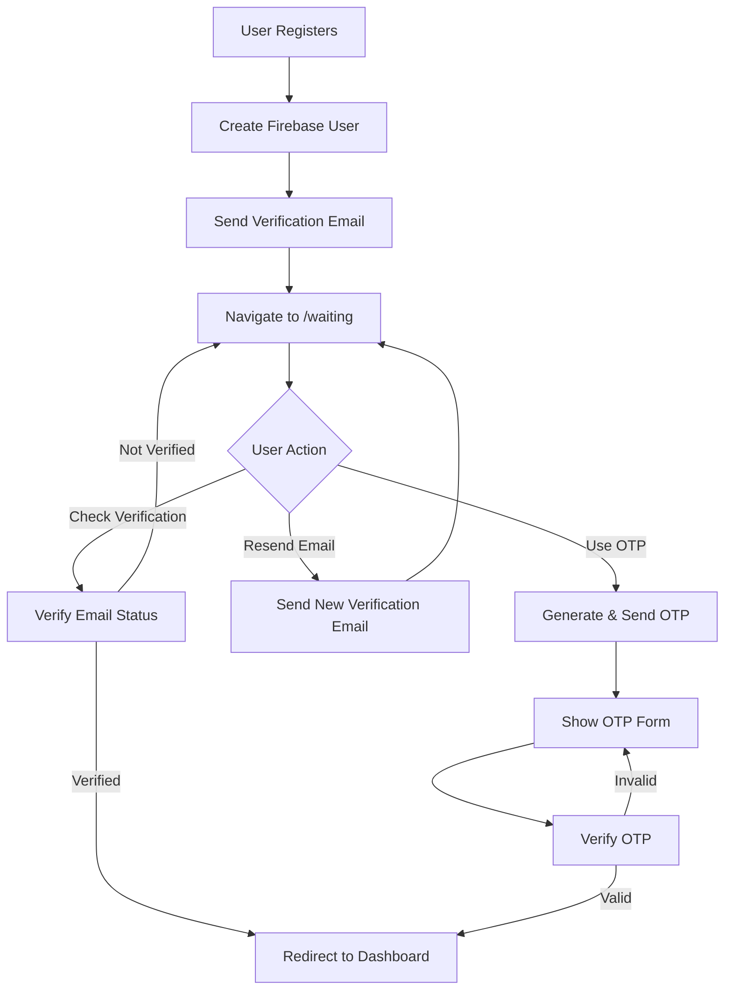

# Waiting Page Authentication System Setup Guide

## 🎯 Overview

This guide explains the enhanced Firebase Authentication system with a dedicated waiting page for email verification. The system provides a seamless user experience with both link-based and OTP-based verification options.

## 🚀 Features Implemented

### ✅ **Registration Flow**
1. **User Registration**: Email + Password registration using Firebase
2. **Automatic Email Verification**: Firebase sends verification email automatically
3. **Waiting Page**: User is redirected to `/waiting` page after registration
4. **No Immediate Dashboard Access**: Users cannot bypass verification

### ✅ **Waiting Page Features**
1. **Email Verification Check**: "I have verified my email" button
2. **Resend Verification**: "Resend verification email" with 60-second cooldown
3. **OTP Alternative**: "Use OTP Verification Instead" option
4. **Auto-Check**: Automatically checks verification status every 2 seconds
5. **User-Friendly UI**: Clear instructions and email display

### ✅ **OTP Verification System**
1. **6-Digit OTP**: Generated and stored in Firestore `/emailOtps/{userId}`
2. **5-Minute Expiry**: OTP expires after 5 minutes (as requested)
3. **Rate Limiting**: Maximum 3 attempts per OTP
4. **Firebase Functions**: Email sending via Cloud Functions
5. **Development Mode**: Shows OTP in console for testing

### ✅ **Security Features**
1. **Route Protection**: Unverified users cannot access protected routes
2. **Automatic Redirects**: Unverified users redirected to waiting page
3. **Firestore Integration**: Email verification status stored in database
4. **Session Management**: Proper user authentication flow

## 📁 Files Created/Modified

### **New Files**
- `src/pages/WaitingPage.jsx` - Main waiting page component
- `WAITING_PAGE_SETUP.md` - This setup guide

### **Modified Files**
- `src/App.jsx` - Added `/waiting` route
- `src/pages/Register.jsx` - Navigate to waiting page after registration
- `src/pages/Login.jsx` - Redirect unverified users to waiting page
- `src/components/ProtectedRoute.jsx` - Enhanced with waiting page redirect
- `src/services/otpService.js` - Updated for 5-minute expiry and userId-based storage
- `src/contexts/AuthContext.jsx` - Enhanced OTP verification functions

## 🔄 Authentication Flow



## 🛠️ Setup Instructions

### **1. Firebase Configuration**

Ensure your Firebase project has:
- Email/Password authentication enabled
- Firestore database configured
- Cloud Functions deployed (for OTP emails)

### **2. Firestore Security Rules**

Update your Firestore rules:

```javascript
rules_version = '2';
service cloud.firestore {
  match /databases/{database}/documents {
    // Allow users to read/write their own OTP codes
    match /emailOtps/{userId} {
      allow read, write: if request.auth != null && request.auth.uid == userId;
    }
    
    // Allow users to read/write their own user data
    match /users/{userId} {
      allow read, write: if request.auth != null && request.auth.uid == userId;
    }
    
    // Your existing rules...
  }
}
```

### **3. Cloud Functions Setup**

Deploy the Cloud Functions for OTP email sending:

```bash
cd functions
npm install
firebase deploy --only functions
```

Configure email credentials:

```bash
firebase functions:config:set email.user="your-email@gmail.com"
firebase functions:config:set email.password="your-app-password"
```

### **4. Environment Variables**

Add to your `.env` file:

```env
REACT_APP_FIREBASE_PROJECT_ID=your-project-id
REACT_APP_FIREBASE_AUTH_DOMAIN=your-project.firebaseapp.com
```

## 🧪 Testing the System

### **Test 1: Email Link Verification**
1. Register with a new email
2. You'll be redirected to `/waiting` page
3. Check your email for verification link
4. Click "I have verified my email" after clicking the link
5. Should redirect to dashboard

### **Test 2: OTP Verification**
1. Register with a new email
2. On waiting page, click "Use OTP Verification Instead"
3. Enter the 6-digit OTP (check console in development mode)
4. Should redirect to dashboard after verification

### **Test 3: Unverified Login**
1. Register but don't verify email
2. Try to login with the same email
3. Should be redirected to waiting page
4. Cannot access dashboard until verified

### **Test 4: Protected Route Access**
1. Register but don't verify email
2. Try to access `/user/dashboard` directly
3. Should be redirected to waiting page
4. Cannot bypass verification

## 🎨 User Interface

### **Waiting Page Features**
- **Clean Design**: Modern UI with SmartAgro branding
- **Email Display**: Shows user's email address
- **Action Buttons**: Clear options for verification
- **Auto-Check**: Automatically detects when email is verified
- **Countdown Timer**: 60-second cooldown for resend
- **OTP Form**: Toggle between email link and OTP verification
- **Help Text**: Instructions to check spam folder
- **Development Mode**: Shows OTP in console for testing

### **Responsive Design**
- Works on all device sizes
- Mobile-friendly interface
- Touch-friendly buttons
- Clear typography

## 🔒 Security Considerations

### **Email Verification**
- **Firebase Default**: Uses Firebase's built-in email verification
- **Link Expiry**: Firebase handles link expiration
- **One-Time Use**: Verification links are single-use

### **OTP Security**
- **5-Minute Expiry**: OTPs expire after 5 minutes
- **Rate Limiting**: Maximum 3 attempts per OTP
- **Secure Storage**: OTPs stored in Firestore with user isolation
- **Automatic Cleanup**: Used/expired OTPs are deleted

### **Route Protection**
- **Authentication Check**: All protected routes require authentication
- **Verification Check**: All protected routes require email verification
- **Automatic Redirects**: Unverified users cannot access protected content
- **Session Management**: Proper user state management

## 🚨 Troubleshooting

### **Common Issues**

1. **Verification Email Not Received**
   - Check spam folder
   - Verify email configuration in Firebase
   - Check Firebase Functions logs

2. **OTP Not Working**
   - Ensure Cloud Functions are deployed
   - Check Firestore permissions
   - Verify email credentials in Cloud Functions

3. **Infinite Redirects**
   - Check Firestore security rules
   - Verify user authentication state
   - Check browser console for errors

4. **Waiting Page Not Loading**
   - Verify route is added to App.jsx
   - Check component imports
   - Verify user state in AuthContext

### **Debug Mode**
- Check browser console for OTP codes in development
- Use Firebase Console to monitor Firestore operations
- Check Cloud Functions logs in Firebase Console
- Monitor authentication state in browser dev tools

## 🔮 Future Enhancements

### **Planned Features**
- **SMS OTP**: Add phone number verification option
- **2FA**: Two-factor authentication for existing users
- **Custom Templates**: Customizable email templates
- **Analytics**: Track verification success rates
- **Multi-language**: Support for multiple languages

### **Advanced Security**
- **IP Whitelisting**: Restrict verification requests by IP
- **Device Fingerprinting**: Track devices for verification
- **Geolocation**: Location-based verification restrictions
- **Time-based**: Restrict verification by time of day

## 📞 Support

If you encounter any issues:

1. Check the browser console for errors
2. Verify Firebase configuration
3. Check Cloud Functions logs
4. Ensure Firestore rules are correct
5. Test with development mode first

## 🎉 Success!

Your waiting page authentication system is now fully functional! Users must verify their email before accessing the dashboard, providing enhanced security and a better user experience for your SmartAgro application.

### **Key Benefits**
- ✅ **Enhanced Security**: Email verification required
- ✅ **Better UX**: Clear waiting page with options
- ✅ **Flexible Verification**: Both email link and OTP options
- ✅ **Automatic Flow**: Seamless user experience
- ✅ **Route Protection**: Secure access to protected content
